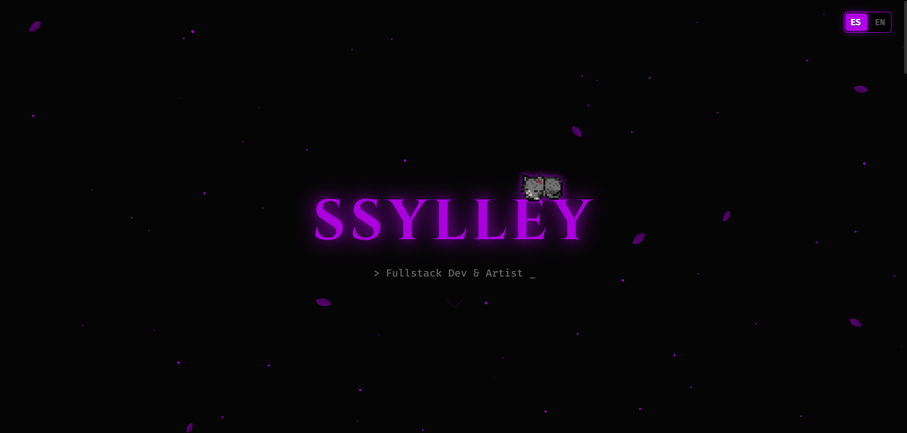

# 💜 Portfolio Personal - Ssylley

> **"Código con alma de artista"**




Bienvenido al repositorio de mi portfolio personal. Este proyecto es una web **SPA (Single Page Application)** diseñada para mostrar mi trayectoria, proyectos, conocimientos y habilidades con una estética inmersiva, que refleje mi personalidad y gustos.

---

## 🌟 Demo en vivo

Puedes ver el proyecto desplegado aquí:
👉 **[ssylley.es](https://ssylley.es)**

---

## 🧠 Metodología y transparencia

> **Tiempo total invertido: ~114 Horas**

Este portfolio ha sido construido bajo una metodología de **desarrollo híbrido**. He adoptado un enfoque de *"AI-Assisted Development"*, utilizando modelos de lenguaje como *pair-programmer* y consultor técnico.

**¿Cómo he trabajado?**
1.  **Arquitectura y diseño:** La dirección creativa, la estructura lógica y la atención al detalle (pixel-perfect) son 100% humanas.
2.  **Optimización con IA:** La IA ha sido utilizada para refinar algoritmos complejos (como la lluvia de pétalos en Canvas), solucionar *edge-cases* en dispositivos móviles específicos (como Xiaomi/Redmi) y limpiar el código.
3.  **Resultado:** Una simbiosis entre creatividad humana y potencia computacional que asegura un rendimiento óptimo y un espectáculo visual y funcional.
4.  **Documentación:** Este archivo README ha sido redactado con la asistencia de una IA para sintetizar las funcionalidades técnicas del proyecto.

---

## ➡️ Características principales

* **Diseño neón / Dark Mode:** Estética cuidada con una paleta de colores oscuros (`#050505`) y detalles en lila neón (`#b100e8`).
* **Internacionalización (i18n):** Sistema de **cambio de idioma (Español / Inglés)** en tiempo real sin recargar la página, gestionado con JavaScript.
* **Mascota interactiva:** Animación de un gato durmiendo en el header apoyado en el nombre que reacciona (se despierta) al hacer click (Sprites CSS + JS).
* **Diseño responsive al detalle:**
    * Adaptado a móviles con pantallas estrechas (Poco X3, Redmi, iPhone).
    * Gestión avanzada de desbordamiento de texto (text-overflow) en tarjetas de contacto.
* **Efectos visuales:**
    * Lluvia de pétalos generada dinámicamente.
    * Tarjetas con efecto *glassmorphism* y bordes brillantes.
    * Scroll suave y animaciones de entrada (`fade-in-up`).
* **Smart contact:** Detecta si el usuario está en móvil para abrir la app de correo predeterminada o una pestaña de Gmail en Chrome.

---

## 🛠️ Tecnologías utilizadas

El proyecto está construido con tecnologías web estándar (Vanilla), sin dependencias pesadas ni frameworks, para asegurar la máxima velocidad de carga.

| Tecnología | Uso |
| :--- | :--- |
|  | Estructura semántica y accesibilidad. |
|  | Flexbox, Grid, Variables CSS (`:root`), Media Queries complejas. |
|  | Manipulación del DOM, lógica de traducción y animaciones. |
|  | Iconografía vectorial. |

---

## 📂 Estructura del proyecto

```bash
📦 portfolio-ssylley
 ┣ 📂 images/            # Assets (gato sprites, avatar, proyectos, miniaturas)
 ┣ 📜 CNAME              # Estructura principal
 ┣ 📜 index.html         # Estructura principal
 ┣ 📜 script.js          # Lógica (traducción, animaciones, pétalos)
 ┣ 📜 ssylley.ico        # Icono representativo
 ┣ 📜 style.css          # Estilos, variables y adaptabilidad móvil
 ┗ 📜 README.md          # Documentación
```
---

<br />
<div align="center">

  <em>"114 horas de código humano, amplificado por inteligencia artificial"</em>
  <br /><br />
  <strong>© 2026 Ssylley Portfolio.</strong>

</div>
